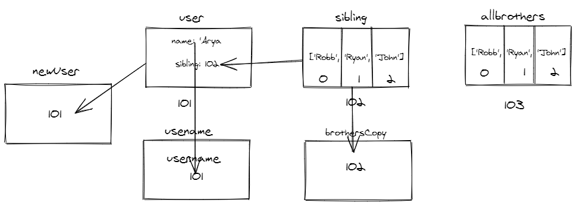

```js
let user = {
  name: 'Arya',
  sibling: ['Robb', 'Ryan', 'John'],
};
let allBrothers = ['Robb', 'Ryan', 'John'];
let brothersCopy = user.sibling;
let usename = user.name;
let newUser = user;
```

1. Memory representation

- Create the memory representation of the above snippet on notebook.
- Take a photo/screenshot and add it to the folder `code`

<!-- To add this image here use  -->

2. Answer the following with reason:

- `user == newUser;` // true because the value is copied by reference
- `user === newUser;`// true. Same as above, since its a string there is no type conversion
- `user.name === newUser.name;`//true becauce name is refered from the same memory address ie 101
- `user.name == newUser.name;` same as above. type conversion doesnt happen
- `user.sibling == newUser.sibling;`//true theyre both refering 102
- `user.sibling === newUser.sibling;`//true same as above and no type connversions
- `user.sibling == allBrothers;`//false because theyre on both seperate memory blocks ie 102 and 103
- `user.sibling === allBrothers;` //false. same as above. no type conversions
- `brothersCopy === allBrothers;`// false. brothersCopy is refered from 102 while allBrothers is 103
- `brothersCopy == allBrothers;`//same as above. No type conversions
- `brothersCopy == user.sibling;`//true because refered from same address 102
- `brothersCopy === user.sibling;`//true. same as above. no type conversions
- `brothersCopy[0] === user.sibling[0];`//true because same address
- `brothersCopy[1] === user.sibling[1];`//true same as above
- `user.sibling[1] === newUser.sibling[1];`//true same address 102
